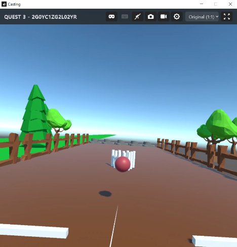

# Playground! 🎮

지적장애인의 인지 발달 및 집중력 향상을 돕기 위한 **인터랙티브 VR 콘텐츠** 프로젝트입니다.  
Unity 기반으로 개발되었으며, Meta Quest 3 기기를 통해 실제 체험 가능한 몰입형 교육 활동을 제공합니다.

---

## 📖 프로젝트 개요
본 프로젝트는 지적장애인의 인지 발달 및 집중력 향상을 돕기 위해 제작된 VR 콘텐츠입니다.  
Unity 기반으로 개발되었으며, **Meta Quest 3** 기기를 통해 몰입형 교육 활동을 제공합니다.

---

## 📅 개발 기간
- **2024.11.08 ~ 2024.12.13**

---

## 💻 플랫폼
- Unity  
- Meta Quest 3

---

## 👥 개발 인원
- 2인

---

## 🛠️ 개발 언어 및 도구
- C#

---

## 🎯 주요 기능
### 1. 심플 메타볼링 🎳
- **목적**: 집중력 및 손-눈 협응 능력 향상  
- **구성**: 사용자가 고개를 움직여 볼링공의 방향을 조준하고, 트리거를 눌러 공을 굴리면 볼링 핀을 향해 직진합니다.  
  정확한 조준에 따라 핀을 쓰러뜨릴 수 있어 **재미 요소**와 **성취감**을 제공합니다.



---

### 2. 낱말 블록 콘텐츠 🧩
- **목적**: 언어 인지력 및 문제 해결력 강화  
- **구성**: 사용자가 낱말 블록을 직접 손으로 집어 이동시키고, 정답 위치에 배치하여 문장을 완성하는 활동입니다.  
  블록을 놓으면 자연스럽게 바닥에 떨어지도록 구현하여 **현실감을 높인 인터랙션**을 제공합니다.


---

## ⚡ 개발 특이사항
- 본 프로젝트는 단순히 교내에서 완성된 것이 아니라, **외부 지적장애인 사립 복지기관과 직접 소통하여 개발**되었습니다.
- 프로젝트 완료 후, 해당 기관에 재학 중인 학생들과 함께 실제 시연을 진행했습니다.
- 과정 중 **직접적인 사용자 피드백을 반영**하여 콘텐츠 완성도를 높였습니다.
- 이러한 실제 적용 사례는 **프로토타입을 넘어 실질적인 현장 활용 가능성**을 보여줍니다.


---

## 📂 프로젝트 구조 (예시)

```plaintext
Playground/
├── Assets/          # Unity 프로젝트 에셋
├── Scripts/         # C# 스크립트
├── Scenes/          # VR 씬 구성
└── README.md        # 프로젝트 설명 문서
